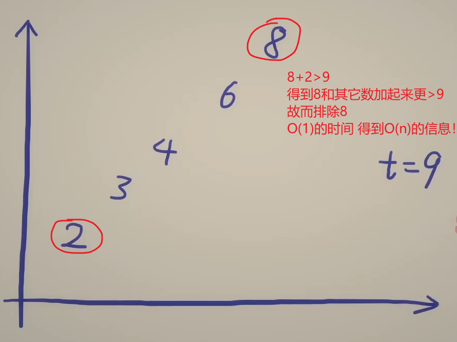
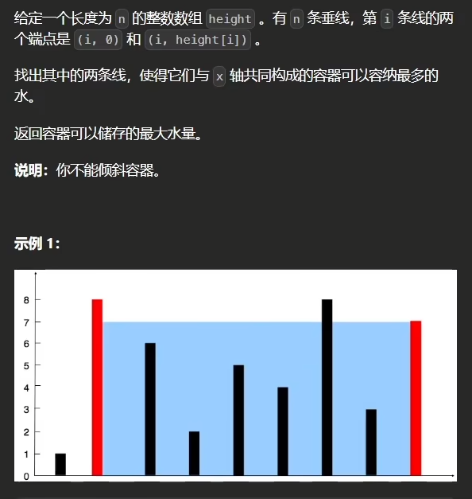
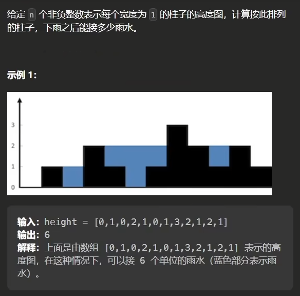
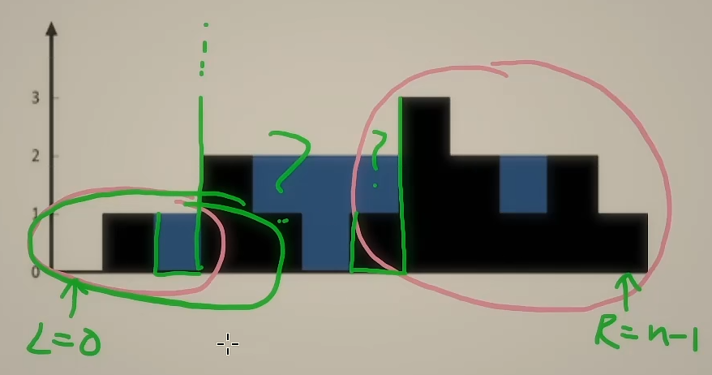

# 02相向双指针

## 1 算法解决的问题、效率及使用条件

- 问题
  - 求两数之和/三数之和恰好等于target
    - 前者时间复杂度n 后者n^2


- 效率
  - 两数之和从传统思想n^2优化到n

- 条件
  - 数组有序？
    - 也未必！
    - 在求两数之和/三数之和时要求有序才能满足每次排除一个数 因为**排除的数和其它数组合不可能满足条件**
    - **排除的数和其它数组合不可能满足条件**这个特征未必要数组有序才行 具体问题具体分析 比如**盛最多水的容器**


## 2 算法的核心思想

- 核心就是：每一次比较必须去掉一个 每次比较知道O(n)的信息

- 求两数之和
  - left<right时 从前后枚举
    - 每一次枚举 去掉不满足条件的一个数(前面/后边的) 知道满足条件
    - O(1)的时间得到O(n)的信息
    - 


## 3 算法的步骤与细节

- 两数之和

```python
class Solution:
    def twoSum(self, numbers: List[int], target: int) -> List[int]:
        n = len(numbers)
        left = 0
        right = n - 1
        while True: # 题目已经说了答案唯一
            s = numbers[left] + numbers[right]
            if s == target:
                return [left+1, right+1]
            if s > target:
                right -= 1
            else:
                left += 1
```

- 三数之和

```python
class Solution:
    def threeSum(self, nums: List[int]) -> List[List[int]]:
        nums.sort()
        ans = []
        n = len(nums)
        for i in range(n - 2):
            x = nums[i]
            # 重复的两个数字 第一个i j(作用范围最大的那个第二个k)已经包含了所有结果 
            # 包括和另一个重复数组一起的结果
            # 所以第二个重复的数字已经没用了 下面的j k同理
            if i > 0 and x == nums[i - 1]:  # 跳过重复数字
                continue
            if x + nums[i + 1] + nums[i + 2] > 0:  # 优化一
                break
            if x + nums[-2] + nums[-1] < 0:  # 优化二
                continue
            j = i + 1
            k = n - 1
            while j < k:    
                s = x + nums[j] + nums[k]   # 每次循环只执行一个分支的操作
                if s > 0:
                    k -= 1
                elif s < 0:
                    j += 1
                else:  # 三数之和为 0 两边都要往里缩
                    ans.append([x, nums[j], nums[k]])
                    j += 1
                    while j < k and nums[j] == nums[j - 1]:  # 跳过重复数字
                        j += 1
                    k -= 1
                    while k > j and nums[k] == nums[k + 1]:  # 跳过重复数字
                        k -= 1
        return ans
```

> 要注意去重的细节

## 4 算法的拓展与变种

### 4-1 盛最多水的容器

- 核心思想：符合相向双指针的特点——**排除的数和其它数组合不可能满足条件**
  - 每次比较两边 必定要排除一个边（短边）
  - 因为短边如果保留 那么在这两个边界之间找任何更长或者更短的边都不会比原来的接雨水面积更大



### 4-2 接雨水

- 核心思想：当前柱子接的雨水 = min(前缀高度， 后缀高度) - 当前柱子高度
  - 分别计算前缀高度、后缀高度 得到两个列表
  - 然后遍历柱子高度数组 累加每个柱子处接的雨水
  - 时间复杂度 n
  - 空间复杂度有待优化



- 优化——相向双指针

  - 

  - 双指针的特点——排除的数和其它数组合不可能满足条件——>或者说每次两边有一个可以确定100%的结果 也可以稳定排除迭代
  - 当前柱子接的雨水 = min(前缀高度， 后缀高度) - 当前柱子高度
    - left 左指针——right 右指针
    - 遍历的同时记录左右后缀的最大值
    - 左边最大值<右边最大值
      - 得出左边柱子的雨水 右边不确定先不计算
      - 左边的指针右移一格
    - 相反(相等的时候算哪个都行 因为最大值不会比这个值更小了)
      - 得出右边柱子的雨水 左边不确定先不计算
      - 右边的指针左移一格